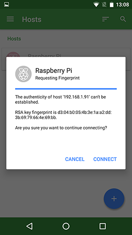
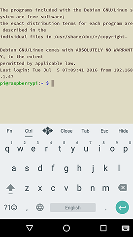

# SSH USING ANDROID

To use SSH on your mobile device you need to download a client. There are several different good quality clients available, such as [Serverauditor](http://www.serverauditor.com), [JuiceSSH](https://juicessh.com/), and [Connectbot](https://connectbot.org/). For the sake of this tutorials we'll use Serverauditor, because it's a popular cross platform SSH client. But the principle is similar and applicable to other clients as well. 


##1. Add your Raspberry pi as a host

Download Serverauditor [Google Play](https://play.google.com/store/apps/details?id=com.server.auditor.ssh.client), if you haven’t it installed yet. And click to open the app.

The app should open showing ‘no hosts’. To get started, you should tap the blue + button in the lower left corner. Then tap ‘New Host’. 


Enter an `alias`, Raspberry Pi, for example. Then enter the IP address under `hostname`. Fill out the `username` and `password` and hit the tick (✓) in the top right corner. 

If you don't know the IP address just type `hostname -I` in the Raspberry Pi. See more [methods](https://www.raspberrypi.org/documentation/remote-access/ip-address.md) of finding your IP address. The default login for Raspbian is `pi` with the password `raspberry`.


##2. Connect

After you’ve saved the new host, you’ll be sent back to the ‘Hosts’ screen. There you’ll find the new entry. Make sure your mobile device has Wi-Fi turned on and connected to the same network as your Raspberry Pi.

Tap the new entry once, when the connections words you’ll see a [security warning](http://www.lysium.de/blog/index.php?/archives/186-How-to-get-ssh-server-fingerprint-information.html). Don’t worry, everything is fine, click ‘Connect’. You’ll only see this warning the first time Serverauditor connects to a Pi that it hasn’t seen before.



You should now have the Raspberry Pi prompt which will be identical to the one found on the Raspberry Pi itself.

```
pi@raspberrypi ~ $
```

You can type `exit` to close the terminal window.



In case a dialogue saying `Connection failed Connecting to 192.xxx.xxx.xxx port 22` you’ve most likely entered a wrong IP address. Otherwise, Wi-Fi on your mobile device might be turned off, the Raspberry Pi might be turned off,  or it in a different network than your mobile device.


##3. Modify an entry, troubleshooting and more

###Modify
You might have made a typo or the IP address or credentials have changed. In this case, you need to update the host.

To do so, in the ‘Hosts’ screen, tap and hold the particular entry. In the top right corner, new functions will pop up. Tap the little pencil icon. A new screen titled ‘Edit Host’ will pop up.

###Check your local network and Wi-Fi status
Make sure your Raspberry Pi is properly set up and connected, if you're using [Wi-Fi](https://www.raspberrypi.org/documentation/configuration/wireless/wireless-cli.md), this is done using the `wpa_supplicant.conf` config file. 

Add the following data to the file:
```
network={
    ssid="Your_SSID"
    psk="Your_wifi_password"
}
```

###Is SSH Enabled?
The Raspberry Pi has an SSH Server enabled by default. The SSH server on your Raspberry Pi may be disabled, in this case you have to enable it manually. This is done using [raspi-config](../../configuration/raspi-config.md):

Enter `sudo raspi-config` in the terminal, then navigate to `ssh`, hit `Enter` and select `Enable or disable ssh server`.
