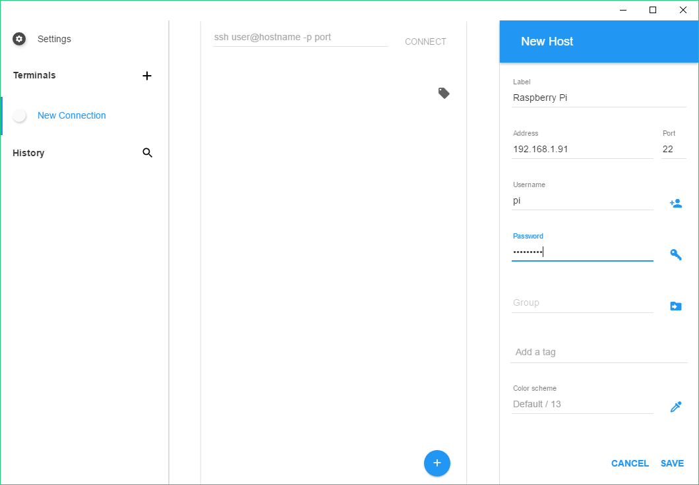

# SSH USING Chrome OS or the Chrome browser 

To use SSH on Chrome OS or through the Chrome browser download a client as an extension. There are several different good quality clients available, such as [Serverauditor](http://www.serverauditor.com), [Secure Shell](https://chromium.googlesource.com/apps/libapps/+show/master/nassh), and  [Mosh](https://mosh.mit.edu/). 

For the sake of this tutorial we'll use Serverauditor, because it's a popular cross platform SSH client. But the principle is applicable to other clients as well. 

## 1. Add your Raspberry pi as a host.
Download Serverauditor from the [Chrome web store](https://chrome.google.com/webstore/detail/serverauditor-ssh-client/fjcdjmmkgnkgihjnlbgcdamkadlkbmam?hl=en), if you haven’t installed it yet. And click to open the app.

Hoover over the big blue `+` in the bottom right corner of the screen and select `Add new host`. A new window will appear. 



Enter a `Label`, ‘Raspberry Pi’, for example. Then enter the IP address under `Address`. Fill out the `Username` and `Password` and hit ‘save’ in the bottom right corner. 

If you don't know the IP address just type `hostname -I` in the Raspberry Pi. See more [methods](../ip-address.md) of finding your IP address. The default login for Raspbian is `pi` with the password `raspberry`.


## 2. Connect

After you’ve saved the new host, it should appear in the center of the window, otherwise click the black `+` next to `Terminals`. 

Make sure your are connected to the same network as your Raspberry Pi. Tap the new entry once, when the connection works you’ll see a [security warning](http://www.lysium.de/blog/index.php?/archives/186-How-to-get-ssh-server-fingerprint-information.html). Don’t worry, everything is fine, click ‘Continue’. You’ll only see this warning the first time Serverauditor connects to a Pi that it hasn’t seen before.


You should now have the Raspberry Pi prompt which will be identical to the one found on the Raspberry Pi itself.

```
pi@raspberrypi ~ $
```

You can type `exit` to close the terminal window.


In case a red exclamation mark will appear, something went wrong. `Connection closed with status: connect -118 nett:EER_CONNECTION_TIMED_OUT (mapped uv code:ETIMEDOUT)` means you’ve most likely entered a wrong IP address. Otherwise, the Raspberry Pi might be turned off, or it is in a different network than your mobile device.

## 3. Modify an entry, troubleshooting and more
A connection might be unsuccessful due to various reasons. Most likely your device or Raspberry Pi are [not connected properly](../../configuration/wireless/wireless-cli.md), [SSH is disabled](../../configuration/raspi-config.md), you might have made a typo, or the IP address or credentials have changed. In the latter cases, you need to update the host.

To do so, in the ‘Terminals’ screen, left click the particular host, and new functions will appear. Tap edit. A new screen titled ‘Edit Host’ will pop up.